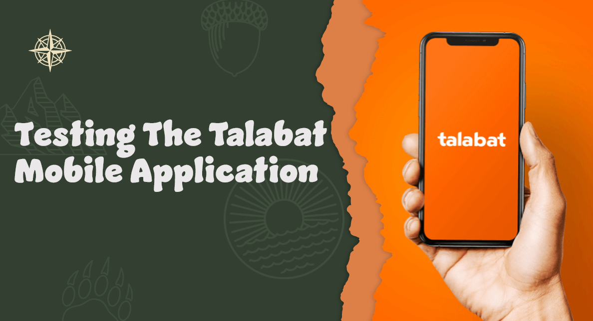

# Talabat App Manual Testing Project  



## 📌 Project Overview  
This project documents the **manual testing process** of the Talabat mobile application.  
The goal is to validate core functionalities such as **search, ordering, checkout, and customer support**, ensuring that the application works as expected and provides a smooth user experience.  

---

## 🛠 Tools Used  
- **Excel** → For writing and tracking test cases and preparing test reports with detailed documentation  
- **Word** → For preparing test plan 
- **Trello** → For managing tasks, tracking progress.

---

## 📑 Project Deliverables  
- ✅ **Test Plan** – High-level strategy and scope of testing  
- ✅ **Test Cases** – Designed in Excel covering different modules (search, order, payment, etc.)  
- ✅ **Bug Reports** – Documented defects with detailed description, steps to reproduce, and screenshots (if available)  
  

---

## 🚀 Key Testing Areas  
- **Search Functionality** (valid & invalid inputs)  
- **Order Placement** (menu selection, cart, checkout)  
- **Payment Gateway** (different payment methods)  
- **UI Testing** (responsiveness, alignment, and usability)  
- **Performance Scenarios** (slow loading, poor network conditions)
- **Compatibility Testing** (different decives & differen OS)  

---

## 📊 Test Management  
All test cases were executed manually, and the results were tracked using **Excel & Trello** for better organization and progress monitoring.  

---

## 🔗 Future Improvements  
In the next phase, this project can be extended with **automation testing** using tools such as:  
- **Selenium / Appium** – For cross-device functional automation  
- **Device Farms (e.g., LambdaTest)** – For running scripts across multiple devices and screen sizes  

---

## 📂 Suggested Repository Structure  
```
/TestPlan                          → Test strategy & scope documents  
/TestCases and BugReports          → Excel sheets with detailed test cases and Bug reports & defect tracking   
/assets                            → Any additional documentation   
README.md                          → Project documentation file  
```

---

## 👨‍💻 Author

Youssef Zaafan Atya  
Email: youssefzafan@gmail.com  
LinkedIn: [Youssef Zaafan](https://www.linkedin.com/in/youssef-zaafan-211482169)
